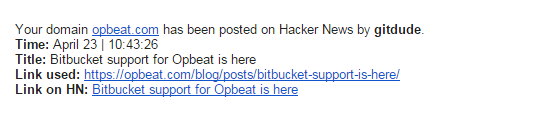

## How to use me ?
### Step 1 - Background and description

##### Technology:
* [nodejs](https://nodejs.org/) - you know what it is :)
* [firebase](https://github.com/HackerNews/API) - hacker news API
* [habitat](https://github.com/brianloveswords/habitat) - env variables
* [nodemailer](https://github.com/andris9/Nodemailer) - email module

##### Description:
Hacker News notifier was built in order to get notifications if your domain has been posted on Hacker News. Tons of articles are going through the Hacker News (1 article per 5-10seconds) and you don't want to track all of those manually and hn-notifier comes to place! :)

### Step 2 - Setup and installation

##### Setup:
In the project you can find ```env.dev``` file with the mockup that you need to fill in.

1. Run ```cp env.dev .env``` - creates a copy of a ```env.dev``` file
2. Fill in your credentials in ```.env``` file for email and domain you want to look for in HN
   
    ```
    export EMAIL=example@gmail.com
    export PASS=password
    export DOMAIN=gmail.com
    export KEYSELECTOR=google
    export NOTIFY=github.com #set the domain you want to be notified
    ```

3. Run ```npm install``` to download all the dependencies with npm manager

##### Start:
```node index.js``` - start the app

#### Email example:


## PS section
You can use [pm2](https://github.com/Unitech/pm2) module to run your app on the background
1. Download and install pm2 -> ```npm install pm2 -g```
2. Start app with ```pm2 start index.js```

## Conclusion
Enjoy getting the emails and then start promoting your article :)

### More to come...
